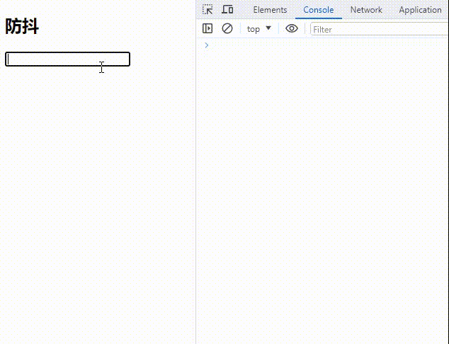
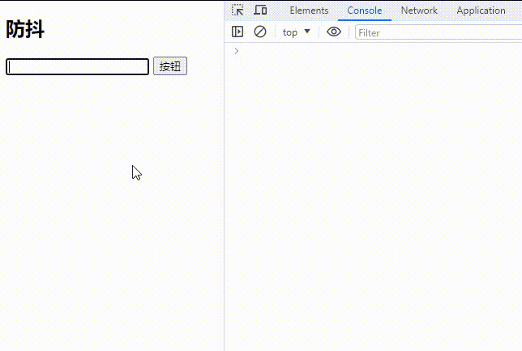

# 防抖debounce函数
其实防抖和节流的概念最早并不是出现在软件工程中，防抖是出现在 **电子元件** 中，节流出现在 **流体流动** 中。

由于 `JavaScript` 是事件驱动的，大量的操作会触发事件，加入到事件队列中处理。所以对于某些 **频繁的事件** 处理会造成性能的损耗，就可以通过防抖和节流来限制事件频繁的发生。

## 防抖的过程
* 当事件触发时，相应的函数并不会立即触发，而是会等待一定的时间。
* 当事件密集触发时，函数的触发会被频繁的推迟。
* 只有等待了一段时间也没有事件触发，才会执行真正的响应函数。

<p align=center>

</p>

### 场景
> 输入框中频繁的输入内容，搜索等。
>
> 频繁的点击按钮，触发某个事件，提交信息等。
>
> 监听浏览器滚动事件，完成某些特定操作。
>
> 用户缩放浏览器的resize事件。

## 防抖的案例
在某些应用程序里都会遇到过这样的场景，在某个 **搜索框中输入** 自己想要搜索的内容：


* 比如想要搜索一个 `iphone`：
  - 当输入 `i` 时，通常会出现对应的 **联想内容**，这是为了更好的用户体验，由于这些联想内容通常是保存在服务器的，所以需要一次网络请求。
  - 当继续输入 `ip` 时，再次发送网络请求。以此类推那么"iphone"一共需要发送 `6` 次网络请求。
  - 这样就会造成系统的性能损耗，无论是前端的事件处理，还是对于服务器的压力。
* 但是真的需要这么多次的网络请求吗？
  - 答案是 **不需要**，合理的做法应该是在合适的情况下再发送网络请求。
  - 比如如果用户快速的输入一个"iphone"，那么只发送一次网络请求。
  - 比如如果用户是输入一个 `ip` 想了(停顿)一会儿，这个时候确实应该发送一次网络请求，把关于"ip"的联想内容展示出来。
  - 也就是说应该监听用户在某个时间，比如500ms内，没有再次触发事件时，再发送网络请求。
* 这就是防抖的操作：只有在 **某个时间** 内，**没有再次触发** 某个函数时，才真正的调用这个函数。

## 防抖的实现
下面就通过用一个输入框案列来实现防抖函数：

监听input的输入，通过打印模拟网络请求。测试默认情况下快速输入一个"iphone"，会发送6次网络请求。
```js
const inputEle = document.querySelector('input');

let counter = 0;
function searchChange() {
  console.log(`发送了${++counter}次网络请求`);
};

inputEle.oninput = searchChange;
```


### 基本实现
现在需要对它进行防抖操作，创建 `01_debounce-基本实现.js` 文件并引入，文件内容如下：
```js
/**
 * 
 * @param {function} fn 需要防抖的事件
 * @param {number} delay 延迟执行的时间(ms)
 * 
 * 1. 定义一个定时器，保存上一次的定时器
 * 2. 创建返回一个真正执行的函数：
 *  2.1 取消上一次的定时器。
 *  2.2 延迟执行外部传入的的函数。
 * 
 */
function debounce(fn, delay) {
  let timer = null;

  function _debounce() {
    if (timer) clearTimeout(timer);

    timer = setTimeout(fn, delay);
  };

  return _debounce;
};

```
然后通过引入文件，并使用定义的 `debounce` 函数处理input输入的事件。此时，再次快速输入一个"iphone"，会发现在等待 `1s` 后才发送了1次网络请求。
```html
<script src="./01_debounce-基本实现.js"></script>
<script>
  //...

  let counter = 0;
  function searchChange() {
    console.log(`发送了${++counter}次网络请求`);
  };

  inputEle.oninput = debounce(searchChange, 1000);
</script>
```

### 优化参数
通过前面代码的基本实现可以做到防抖，只有在 `1s` 内无触发事件才会发送网络请求。

但是，现在的功能函数还并不能满足日常使用的场景。通过在 `searchChange` 打印事件触发的一些参数 `event` 和调用者 `this`，会发现控制台输出的是 `undefined` 和 `Window`。此时可以发现，它存在一些问题。想要拿到正确的信息，这个函数是无能为力的。

所以，需要对它进行优化，创建文件 `02_debounce-参数-this.js`文件。优化后的代码如下：
```js
/**
 * 
 * @param {function} fn 需要防抖的事件
 * @param {number} delay 延迟执行的时间(ms)
 * 
 * 1. 定义一个定时器，保存上一次的定时器
 * 2. 创建返回一个真正执行的函数：
 *  2.1 取消上一次的定时器。
 *  2.2 延迟执行外部传入的的函数(事件)。
 * 
 * 3. 将不定数量的参数放入到一个数组args中。
 * 4. 给事件函数绑定this，改变this指向调用者。
 * 
 */
function debounce(fn, delay) {
  let timer = null;

  function _debounce(...args) {
    if (timer) clearTimeout(timer);

    timer = setTimeout(() => {
      fn.apply(this, args);
    }, delay);
  };

  return _debounce;
};


```
接着回到 `index.html` 再来引入02文件，使用函数并打印相关参数。可以看到相应内容都能正确获取了！
```html
  <script src="./02_debounce-参数-this.js"></script>
  <script>
    // ...

    // 02_优化参数
    let counter = 0;
    function searchChange(event) {
      console.log('this: ', this); // HTMLInputElement
      console.log(`事件: ${event.target.value} - 发送了 ${++counter} 次网络请求`);
    };

    inputEle.oninput = debounce(searchChange, 1000);
  </script>
```

#### 关于
优化使用到的相关特性
* [函数参数：rest parameter](https://juejin.cn/post/7208765341409116216#heading-20)
* [this绑定规则：apply](https://juejin.cn/post/7108671776418168863#heading-2)

### 优化立即执行
前面的防抖函数实现基本上已经足够日常场景中使用了。接下来进一步优化，让函数具有更多功能更强大。改造函数接受第三个参数 `immediate` 用于决定事件函数是否立即触发。
```js
/**
 * 
 * @param {function} fn 需要防抖的事件
 * @param {number} delay 延迟执行的时间(ms)
 * @param {boolean} [immediate = false] 事件函数是否立即触发
 * 
 * 1. 定义一个定时器，保存上一次的定时器
 * 2. 创建返回一个真正执行的函数：
 *  2.1 取消上一次的定时器。
 *  2.2 延迟执行外部传入的的函数(事件)。
 * 
 * 3. 将不定数量的参数放入到一个数组(args)中。
 * 4. 给事件函数绑定this，改变this指向调用者。
 * 
 * 5. 定义立即执行是否已经调用过了的标识(inInvoke = false)。没调用过的话就立即执行传入的事件函数，然后更改标识为true。
 * 6. 立即执行过后，事件再次触发就会进入防抖程序中，当防抖执行完毕，就重置标识状态。这样下次再触发事件就会再走一遍这个流程。
 * 
 * @returns {function} _debounce
 * 
 */
function debounce(fn, delay, immediate = false) {
  let timer = null;
  let inInvoke = false;

  function _debounce(...args) {
    if (timer) clearTimeout(timer);

    if (immediate && !inInvoke) {
      fn.apply(this, args);
      
      inInvoke = true;
    }
    else {
      timer = setTimeout(() => {
        fn.apply(this, args);

        inInvoke = false;
      }, delay);
    }
  };

  return _debounce;
};

```

创建文件 `03_debounce-立即执行.js`，在页面中引入。当输入框输入内容时，立即执行事件函数。然后再输入时就会进入防抖，只有防抖过并执行完毕后，下次再触发事件函数时才会立即执行。
```html
  <script src="./03_debounce-立即执行.js"></script>
  <script>
    // ...

    // 03_立即执行
    let counter = 0;
    function searchChange(event) {
      console.log('this: ', this); // HTMLInputElement
      console.log(`事件: ${event.target.value} - 发送了 ${++counter} 次网络请求`);
    };

    inputEle.oninput = debounce(searchChange, 1000, true);
  </script>
```


### 优化取消功能
光有立即执行功能可不够，如果判定某次立即执行就已经把结果搜索出来了，就不要再走防抖程序了，把程序取消掉。但注意取消的时候要把是否已经立即执行的标识状态重置掉，这样等再次输入时就会触发立即执行事件，如果开了立即执行开关。
```js
/**
 * 
 * ...
 * 
 * 7. 给真正执行的函数定义一个取消函数属性，取消防抖同时重置标识。
 * 
 * @returns {function} _debounce
 * 
 */
function debounce(fn, delay, immediate = false) {
  let timer = null;
  let inInvoke = false;

  function _debounce(...args) {
    if (timer) clearTimeout(timer);

    if (immediate && !inInvoke) {
      fn.apply(this, args);
      
      inInvoke = true;
    }
    else {
      timer = setTimeout(() => {
        fn.apply(this, args);

        inInvoke = false;
      }, delay);
    }
  };

  _debounce.cancel = function() {
    if (timer) clearTimeout(timer);

    inInvoke = false;
  };

  return _debounce;
};

```

比如一直输入 `iphone` 字段时，当输入 `i` 时有一堆联想词出来了，其中就有想要搜索的关键字 `iphone15`，接着点击这个关键字后页面跳转了，而后面的输入内容 `phone` 就不应该触发网络请求了。
```html

  <button id="button">按钮</button>

  <script src="./04_debounce-取消功能.js"></script>
  <script>
    const btnEle = document.getElementById('button');

    //...

    // 04_取消功能
    let counter = 0;
    function searchChange(event) {
      console.log('this: ', this); // HTMLInputElement
      console.log(`事件: ${event.target.value} - 发送了 ${++counter} 次网络请求`);
    };

    const _debounce = debounce(searchChange, 1000, true);
    inputEle.oninput = _debounce;
    
    btnEle.onclick = function() {
      _debounce.cancel();
    };
  </script>
```

