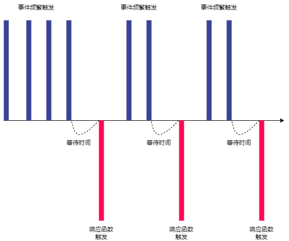
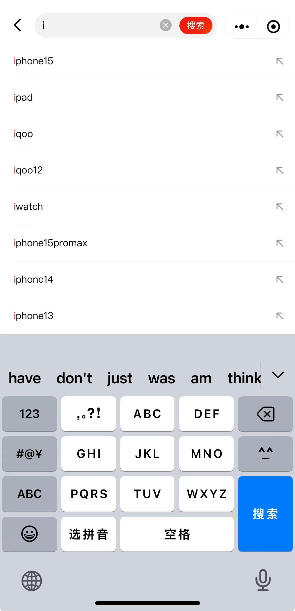
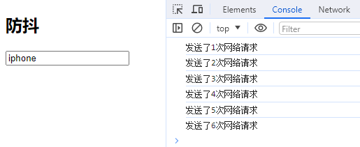

# 防抖debounce函数
其实防抖和节流的概念最早并不是出现在软件工程中，防抖是出现在 **电子元件** 中，节流出现在 **流体流动** 中。

由于 `JavaScript` 是事件驱动的，大量的操作会触发事件，加入到事件队列中处理。所以对于某些 **频繁的事件** 处理会造成性能的损耗，就可以通过防抖和节流来限制事件频繁的发生。

## 防抖的过程
* 当事件触发时，相应的函数并不会立即触发，而是会等待一定的时间。
* 当事件密集触发时，函数的触发会被频繁的推迟。
* 只有等待了一段时间也没有事件触发，才会执行真正的响应函数。

<p align=center>

</p>

### 场景
> 输入框中频繁的输入内容，搜索等。
>
> 频繁的点击按钮，触发某个事件，提交信息等。
>
> 监听浏览器滚动事件，完成某些特定操作。
>
> 用户缩放浏览器的resize事件。

## 防抖的案例
在某些应用程序里都会遇到过这样的场景，在某个 **搜索框中输入** 自己想要搜索的内容：


* 比如想要搜索一个 `iphone`：
  - 当输入 `i` 时，通常会出现对应的 **联想内容**，这是为了更好的用户体验，由于这些联想内容通常是保存在服务器的，所以需要一次网络请求。
  - 当继续输入 `ip` 时，再次发送网络请求。以此类推那么"iphone"一共需要发送 `6` 次网络请求。
  - 这样就会造成系统的性能损耗，无论是前端的事件处理，还是对于服务器的压力。
* 但是真的需要这么多次的网络请求吗？
  - 答案是 **不需要**，合理的做法应该是在合适的情况下再发送网络请求。
  - 比如如果用户快速的输入一个"iphone"，那么只发送一次网络请求。
  - 比如如果用户是输入一个 `ip` 想了(停顿)一会儿，这个时候确实应该发送一次网络请求，把关于"ip"的联想内容展示出来。
  - 也就是说应该监听用户在某个时间，比如500ms内，没有再次触发事件时，再发送网络请求。
* 这就是防抖的操作：只有在 **某个时间** 内，**没有再次触发** 某个函数时，才真正的调用这个函数。

## 防抖的实现
下面就通过用一个输入框案列来实现防抖函数：

监听input的输入，通过打印模拟网络请求。测试默认情况下快速输入一个"iphone"，会发送6次网络请求。
```js
const inputEle = document.querySelector('input');

let counter = 0;
function searchChange() {
  console.log(`发送了${++counter}次网络请求`);
};

inputEle.oninput = searchChange;
```


### 基本实现
现在需要对它进行防抖操作，创建 `01_debounce-基本实现.js` 文件并引入，文件内容如下：
```js
/**
 * 
 * @param {function} fn 需要防抖的事件
 * @param {number} delay 延迟执行的时间(ms)
 * 
 * 1. 定义一个定时器，保存上一次的定时器
 * 2. 创建返回一个真正执行的函数：
 *  2.1 取消上一次的定时器。
 *  2.2 延迟执行外部传入的的函数。
 * 
 */
function debounce(fn, delay) {
  let timer = null;

  function _debounce() {
    if (timer) clearTimeout(timer);

    timer = setTimeout(fn, delay);
  };

  return _debounce;
};

```
然后通过引入文件，并使用定义的 `debounce` 函数处理input输入的事件。此时，再次快速输入一个"iphone"，会发现在等待 `1s` 后才发送了1次网络请求。
```html
<script src="./01_debounce-基本实现.js"></script>
<script>
  //...

  let counter = 0;
  function searchChange() {
    console.log(`发送了${++counter}次网络请求`);
  };

  inputEle.oninput = debounce(searchChange, 1000);
</script>
```
