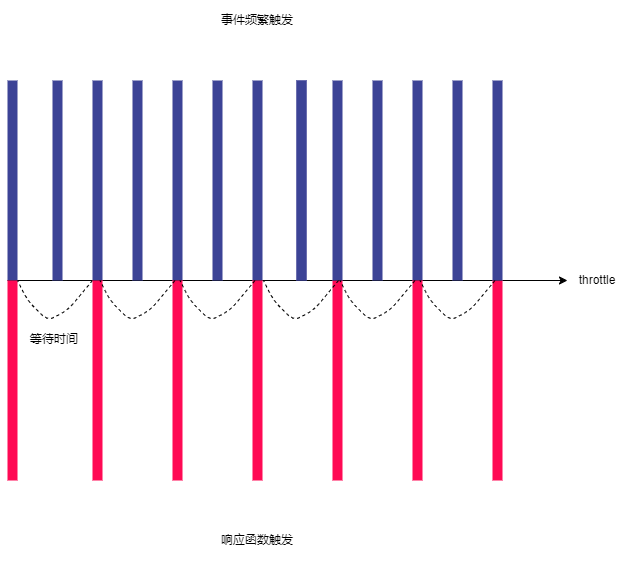

# 节流throttle函数
其实防抖和节流的概念最早并不是出现在软件工程中，防抖是出现在 **电子元件** 中，节流出现在 **流体流动** 中。

由于 `JavaScript` 是事件驱动的，大量的操作会触发事件，加入到事件队列中处理。所以对于某些 **频繁的事件** 处理会造成性能的损耗，就可以通过防抖和节流来限制事件频繁的发生。

## 节流的过程
* 当事件触发时，会执行这个事件的响应函数。
* 如果这个事件被频繁的触发，那节流函数会按照一定的频率来执行响应函数。
* 不管在这个中间有多少次触发事件，执行函数的频率总是固定的。

### 场景
> 监听页面的滚动事件。
>
> 鼠标移动事件。
>
> 用户频繁点击按钮操作。
>
> 游戏中的一些设计。

## 节流的案例
很多人都玩过具有固定攻击频率的游戏，LOL中的英雄平a攻击，飞机大战中子弹射击，捕鱼达人中发射子弹等。

尤其是在飞机大战的游戏中，按下空格时会发射一个子弹：
* 很多飞机大战的游戏中都会有这样的设定，即使按下的 **频率再快**，子弹也会保持 **一定的频率** 来发射。
* 比如 `1` 秒钟只能发射一次，即使玩家在这1秒钟按下了 `10` 次，子弹也会保持发射一发的频率来发射。
* 实际上事件是触发了 `10` 次的，只是 **响应的函数只触发了一次**。
