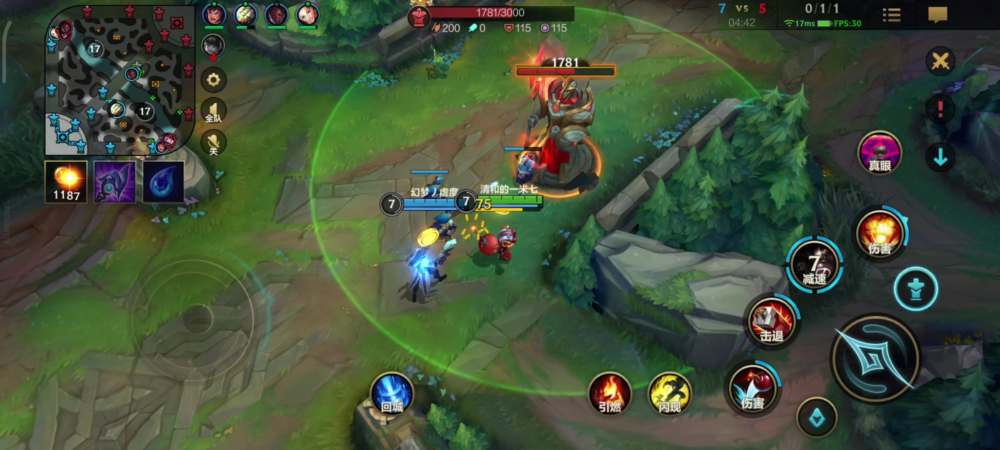

# 节流throttle函数
其实防抖和节流的概念最早并不是出现在软件工程中，防抖是出现在 **电子元件** 中，节流出现在 **流体流动** 中。

由于 `JavaScript` 是事件驱动的，大量的操作会触发事件，加入到事件队列中处理。所以对于某些 **频繁的事件** 处理会造成性能的损耗，就可以通过防抖和节流来限制事件频繁的发生。

## 节流的过程
* 当事件触发时，会执行这个事件的响应函数。
* 如果这个事件被频繁的触发，那节流函数会按照一定的频率来执行响应函数。
* 不管在这个中间有多少次触发事件，执行函数的频率总是固定的。

<p align=center>

</p>

### 场景
> 监听页面的滚动事件。
>
> 鼠标移动事件。
>
> 用户频繁点击按钮操作。
>
> 游戏中的一些设计。

## 节流的案例
很多人都玩过具有固定攻击频率的游戏，LOL中的英雄平a攻击，飞机大战中子弹射击，捕鱼达人中发射子弹等。



尤其是在飞机大战的游戏中，按下空格时会发射一个子弹：
* 很多飞机大战的游戏中都会有这样的设定，即使按下的 **频率再快**，子弹也会保持 **一定的频率** 来发射。
* 比如 `1` 秒钟只能发射一次，即使玩家在这1秒钟按下了 `10` 次，子弹也会保持发射一发的频率来发射。
* 实际上事件是触发了 `10` 次的，只是 **响应的函数只触发了一次**。

## 节流的实现
下面就通过用一个输入框案例来实现节流函数：

监听input的输入，通过打印模拟网络请求。测试默认情况下快速输入一个"iphone"，会发送6次网络请求。
```js
const inputEle = document.querySelector('input');

// 00_默认情况
let counter = 0;
function searchChange(event) {
  console.log('this: ', this); // HTMLInputElement
  console.log(`事件: ${event.target.value} - 发送了 ${++counter} 次网络请求`);
};

inputEle.oninput = searchChange;
```


### 基本实现
现在需要对它进行 **节流** 操作，创建 `01_throttle-基本实现.js` 文件并引入。经过实现[防抖函数](../05_debounce)知道它如果需要拿到一些参数，就要对执行的函数做绑定处理。文件内容如下：
```js
/**
 * 
 * @param {function} fn 需要防抖的事件
 * @param {number} interval[ms] 间隔执行的时间
 * 
 * 1. 记录上次开始的时间。
 * 2. 创建并返回事件触发时，真正执行的函数
 *  2.1 获取当前事件触发的时间。
 *  2.1 使用当前时间和上次的开始时间以及间隔时间，计算出还剩余多长时间需要去触发事件函数。
 *  2.3 真正触发函数并保留上次触发的时间。
 * 
 * @returns _throttle
 */
function throttle(fn, interval) {
  let lastTime = 0;

  function _throttle(...args) {
    let nowTime = new Date().getTime();

    const remainTime = interval - (nowTime - lastTime);
    if (remainTime <= 0) {
      fn.apply(this, args);

      lastTime = nowTime;
    }
  };

  return _throttle;
};

```
接着回到 `index.html` 使用函数并打印相关参数。可以看到相应内容都能正确获取了！
```html
  <script src="./01_throttle-基本实现.js"></script>
  <script>
    const inputEle = document.querySelector('input');

    // 01_基本实现
    let counter = 0;
    function searchChange(event) {
      console.log('this: ', this); // HTMLInputElement
      console.log(`事件: ${event.target.value} - 发送了 ${++counter} 次网络请求`);
    };

    inputEle.oninput = throttle(searchChange, 2000);

    </script>
```
由于第一次 `lastTime` 是0，所以每次第一次事件函数触发就会执行，下面将优化这一场景，来控制第一次是否执行。

#### 关于
优化使用到的相关特性
* [函数参数：rest parameter](https://juejin.cn/post/7208765341409116216#heading-20)
* [this绑定规则：apply](https://juejin.cn/post/7108671776418168863#heading-2)
